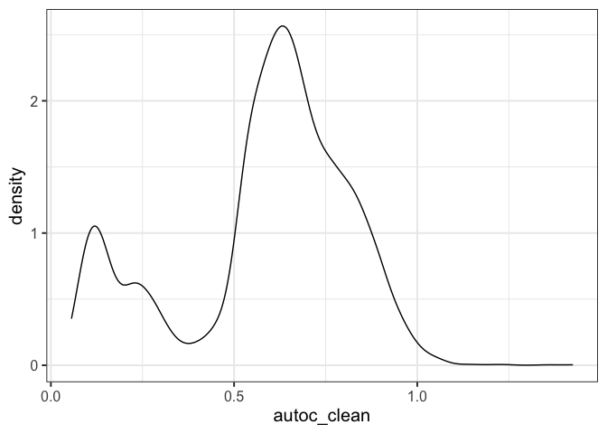
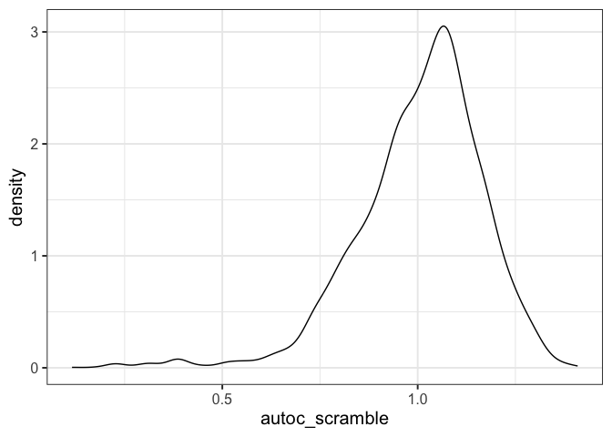
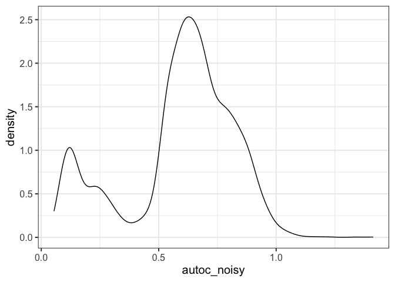

Sense-check 1-norm AUTOC
================
eleanorjackson
09 July, 2026

``` r
library("tidyverse")
library("here")
library("patchwork")
```

``` r
# get my functions
function_dir <- list.files(here::here("code", "functions"),
                           full.names = TRUE)

sapply(function_dir, source)
```

    ##         /Users/user/Library/CloudStorage/OneDrive-Nexus365/tree/code/functions/assign-treatment.R
    ## value   ?                                                                                        
    ## visible FALSE                                                                                    
    ##         /Users/user/Library/CloudStorage/OneDrive-Nexus365/tree/code/functions/autoc.R
    ## value   ?                                                                             
    ## visible FALSE                                                                         
    ##         /Users/user/Library/CloudStorage/OneDrive-Nexus365/tree/code/functions/fit-metalearner.R
    ## value   ?                                                                                       
    ## visible FALSE                                                                                   
    ##         /Users/user/Library/CloudStorage/OneDrive-Nexus365/tree/code/functions/morans-i.R
    ## value   ?                                                                                
    ## visible FALSE                                                                            
    ##         /Users/user/Library/CloudStorage/OneDrive-Nexus365/tree/code/functions/qini-coef.R
    ## value   ?                                                                                 
    ## visible FALSE                                                                             
    ##         /Users/user/Library/CloudStorage/OneDrive-Nexus365/tree/code/functions/sample-data.R
    ## value   ?                                                                                   
    ## visible FALSE

``` r
# get data
all_runs <-
  readRDS(here::here("data", "derived", "all_runs_10.rds"))
```

``` r
all_runs <- all_runs %>%
  mutate(autoc_clean = purrr::map(
    .x = df_out,
    .f = ~ autoc_norm_vec(truth = .x$cate_real,
                     estimate = .x$cate_pred)
  )) %>%
  unnest(autoc_clean) %>%
  mutate(autoc_clean = 1 - autoc_clean) # so lower is better
```

``` r
# 0 = perfect ranking and 1 = no useful ranking
all_runs %>% 
  ggplot(aes(x = autoc_clean)) +
  geom_density()
```

<!-- -->

now scramble

``` r
all_runs <- all_runs %>%
  mutate(
    df_out = map(
      df_out,
      ~ mutate(.x, cate_pred_scramble = sample(cate_pred))
    )
  ) %>%
  mutate(autoc_scramble = purrr::map(
    .x = df_out,
    .f = ~ autoc_norm_vec(truth = .x$cate_real,
                     estimate = .x$cate_pred_scramble)
  )) %>%
  unnest(autoc_scramble) %>%
  mutate(autoc_scramble = 1 - autoc_scramble) # so lower is better
```

``` r
# 0 = perfect ranking and 1 = no useful ranking
all_runs %>% 
  ggplot(aes(x = autoc_scramble)) +
  geom_density()
```

<!-- -->

try adding small amount of error - Gaussian noise

``` r
all_runs <- all_runs %>%
  mutate(
    df_out = purrr::map(df_out, ~
      dplyr::mutate(
        .x,
        cate_pred_noisy = 
          cate_pred + rnorm(length(cate_pred), 
                            mean = 0, 
                            sd = sd(cate_pred) * 0.1)
      )
    )
  ) %>%
  mutate(autoc_noisy = purrr::map(
    .x = df_out,
    .f = ~ autoc_norm_vec(truth = .x$cate_real,
                     estimate = .x$cate_pred_noisy)
  )) %>%
  unnest(autoc_noisy) %>%
  mutate(autoc_noisy = 1 - autoc_noisy) # so lower is better
```

``` r
# 0 = perfect ranking and 1 = no useful ranking
all_runs %>% 
  ggplot(aes(x = autoc_noisy)) +
  geom_density()
```

<!-- -->

``` r
all_runs %>% 
  summarise(median(autoc_clean), 
            median(autoc_scramble),  
            median(autoc_noisy))
```

    ## # A tibble: 1 × 3
    ##   `median(autoc_clean)` `median(autoc_scramble)` `median(autoc_noisy)`
    ##                   <dbl>                    <dbl>                 <dbl>
    ## 1                 0.630                     1.03                 0.633

median(autoc_clean) → better than random

median(autoc_noisy) → small amount of error is similar to autoc_clean

median(autoc_scramble) → essentially null
