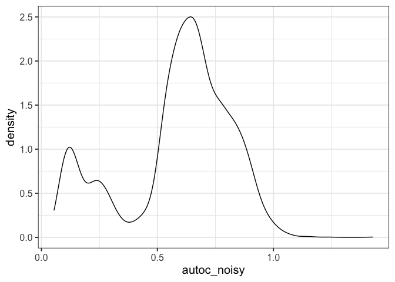

Sense-check 1-norm AUTOC
================
eleanorjackson
09 July, 2026

``` r
library("tidyverse")
library("here")
library("patchwork")
```

``` r
# get my functions
function_dir <- list.files(here::here("code", "functions"),
                           full.names = TRUE)

sapply(function_dir, source)
```

    ##         /Users/user/Library/CloudStorage/OneDrive-Nexus365/tree/code/functions/assign-treatment.R
    ## value   ?                                                                                        
    ## visible FALSE                                                                                    
    ##         /Users/user/Library/CloudStorage/OneDrive-Nexus365/tree/code/functions/autoc.R
    ## value   ?                                                                             
    ## visible FALSE                                                                         
    ##         /Users/user/Library/CloudStorage/OneDrive-Nexus365/tree/code/functions/fit-metalearner.R
    ## value   ?                                                                                       
    ## visible FALSE                                                                                   
    ##         /Users/user/Library/CloudStorage/OneDrive-Nexus365/tree/code/functions/morans-i.R
    ## value   ?                                                                                
    ## visible FALSE                                                                            
    ##         /Users/user/Library/CloudStorage/OneDrive-Nexus365/tree/code/functions/qini-coef.R
    ## value   ?                                                                                 
    ## visible FALSE                                                                             
    ##         /Users/user/Library/CloudStorage/OneDrive-Nexus365/tree/code/functions/sample-data.R
    ## value   ?                                                                                   
    ## visible FALSE

``` r
# get data
all_runs <-
  readRDS(here::here("data", "derived", "all_runs_10.rds"))
```

``` r
all_runs <- all_runs %>%
  mutate(autoc_clean = purrr::map(
    .x = df_out,
    .f = ~ autoc_norm_vec(truth = .x$cate_real,
                     estimate = .x$cate_pred)
  )) %>%
  unnest(autoc_clean) %>%
  mutate(autoc_clean = 1 - autoc_clean) # so lower is better
```

``` r
# 0 = perfect ranking and 1 = no useful ranking
all_runs %>% 
  ggplot(aes(x = autoc_clean)) +
  geom_density()
```

<!-- -->

perfect autoc:

``` r
all_runs <- all_runs %>%
  mutate(autoc_perfect = purrr::map(
    .x = df_out,
    .f = ~ autoc_norm_vec(truth = .x$cate_real,
                     estimate = .x$cate_real)
  )) %>%
  unnest(autoc_perfect) %>%
  mutate(autoc_perfect = 1 - autoc_perfect) # so lower is better
```

``` r
# 0 = perfect ranking and 1 = no useful ranking, here, all = 0 
all_runs %>% 
  glimpse()
```

    ## Rows: 4,320
    ## Columns: 12
    ## $ assignment         <fct> random, random, random, random, random, random, ran…
    ## $ prop_not_treated   <dbl> 0.3, 0.3, 0.3, 0.3, 0.3, 0.3, 0.3, 0.3, 0.3, 0.3, 0…
    ## $ n_train            <dbl> 250, 250, 250, 250, 250, 250, 250, 250, 250, 250, 2…
    ## $ learner            <fct> s, s, s, s, s, s, s, s, s, s, s, s, s, s, s, s, s, …
    ## $ var_omit           <fct> none, none, none, none, none, none, none, none, non…
    ## $ test_plot_location <fct> stratified, stratified, stratified, stratified, str…
    ## $ run_id             <int> 1, 2, 3, 4, 5, 6, 7, 8, 9, 10, 11, 12, 13, 14, 15, …
    ## $ df_assigned        <list> [<tbl_df[1806 x 26]>], [<tbl_df[1806 x 26]>], [<tb…
    ## $ df_train           <list> [<tbl_df[250 x 26]>], [<tbl_df[250 x 26]>], [<tbl_…
    ## $ df_out             <list> [<tbl_df[108 x 28]>], [<tbl_df[108 x 28]>], [<tbl_…
    ## $ autoc_clean        <dbl> 0.6903083, 0.6347699, 0.8503038, 0.6859188, 0.12976…
    ## $ autoc_perfect      <dbl> 0, 0, 0, 0, 0, 0, 0, 0, 0, 0, 0, 0, 0, 0, 0, 0, 0, …

now scramble

``` r
all_runs <- all_runs %>%
  mutate(
    df_out = map(
      df_out,
      ~ mutate(.x, cate_pred_scramble = sample(cate_pred))
    )
  ) %>%
  mutate(autoc_scramble = purrr::map(
    .x = df_out,
    .f = ~ autoc_norm_vec(truth = .x$cate_real,
                     estimate = .x$cate_pred_scramble)
  )) %>%
  unnest(autoc_scramble) %>%
  mutate(autoc_scramble = 1 - autoc_scramble) # so lower is better
```

``` r
# 0 = perfect ranking and 1 = no useful ranking
all_runs %>% 
  ggplot(aes(x = autoc_scramble)) +
  geom_density()
```

<!-- -->

try adding small amount of error - Gaussian noise

``` r
all_runs <- all_runs %>%
  mutate(
    df_out = purrr::map(df_out, ~
      dplyr::mutate(
        .x,
        cate_pred_noisy = 
          cate_pred + rnorm(length(cate_pred), 
                            mean = 0, 
                            sd = sd(cate_pred) * 0.1)
      )
    )
  ) %>%
  mutate(autoc_noisy = purrr::map(
    .x = df_out,
    .f = ~ autoc_norm_vec(truth = .x$cate_real,
                     estimate = .x$cate_pred_noisy)
  )) %>%
  unnest(autoc_noisy) %>%
  mutate(autoc_noisy = 1 - autoc_noisy) # so lower is better
```

``` r
# 0 = perfect ranking and 1 = no useful ranking
all_runs %>% 
  ggplot(aes(x = autoc_noisy)) +
  geom_density()
```

<!-- -->

``` r
all_runs %>% 
  summarise(median(autoc_perfect),
            median(autoc_clean), 
            median(autoc_scramble),  
            median(autoc_noisy))
```

    ## # A tibble: 1 × 4
    ##   `median(autoc_perfect)` `median(autoc_clean)` `median(autoc_scramble)`
    ##                     <dbl>                 <dbl>                    <dbl>
    ## 1                       0                 0.630                     1.02
    ## # ℹ 1 more variable: `median(autoc_noisy)` <dbl>

median(autoc_clean) → better than random

median(autoc_noisy) → small amount of error is similar to autoc_clean

median(autoc_scramble) → essentially null
