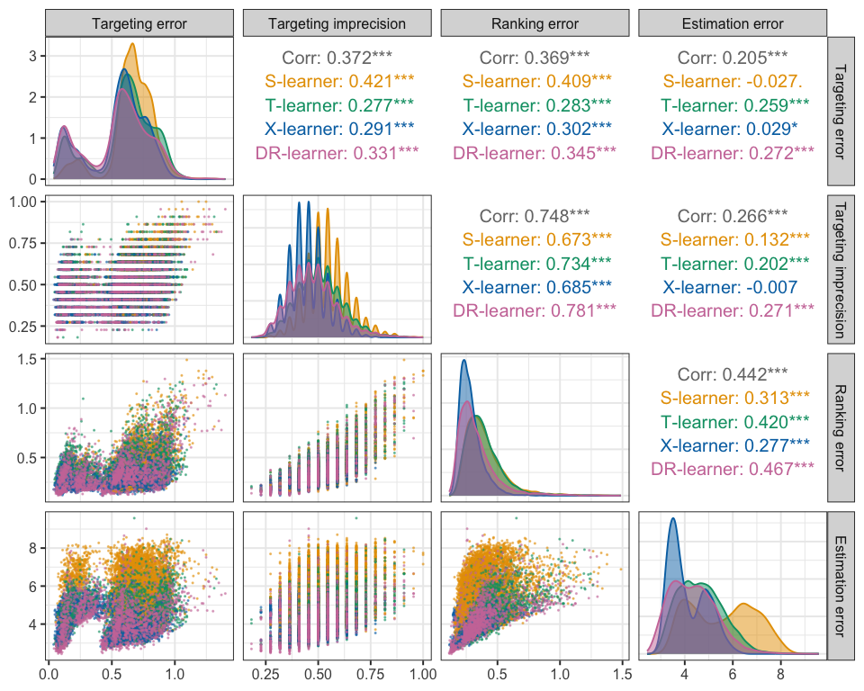

Check pairwise correlations between performace metrics
================
Becks Spake
23 July, 2026

``` r
library("tidyverse")
library("here")
library("patchwork")
library("GGally")
```

``` r
results <-
  readRDS(here::here("data", "derived", "results.rds")) %>%
  mutate(
    learner = recode_factor(
      learner,
      s = "S-learner",
      t = "T-learner",
      x = "X-learner",
      dr = "DR-learner",
      .ordered = TRUE
    ))
```

``` r
cols <- c(
  "S-learner" = "#E69F00",
  "T-learner" = "#009E73",
  "X-learner" = "#0072B2",
  "DR-learner" = "#CC79A7"
)

GGally::ggpairs(
  results,
  mapping = aes(colour = learner, fill = learner),
  columns = c("autoc", "top_k", "spearman", "rmse"),
  columnLabels = c("Targeting error", 
                   "Targeting imprecision", 
                   "Ranking error",
                   "Estimation error"),
  lower = list(
    continuous = wrap("points", alpha = 0.5, size = 0.2)
  ),
  diag = list(
    continuous = wrap("densityDiag", alpha = 0.5)
  ),
  upper = list(
    continuous = GGally::wrap(
      "cor",
      method = "spearman",
      group_args = list(colour = cols)
    )
  ),
  progress = FALSE
) +
  scale_colour_manual(values = cols) +
  scale_fill_manual(values = cols)  
```

<!-- -->
